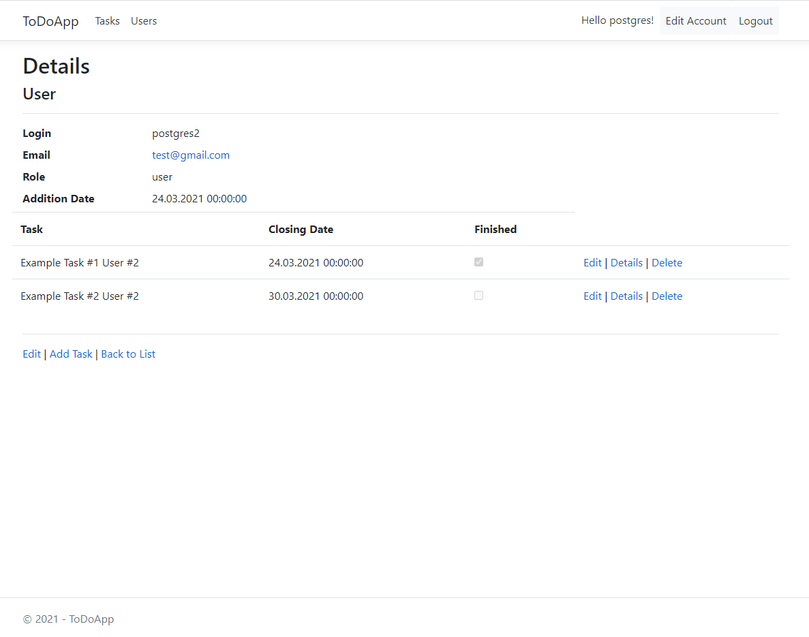

# ToDoApp
## General Info
The project is a web application which operates on an existing database(based on PostgreSQL) containing lists of tasks assigned to users. Once a user is registered, the application allows to create, edit and delete tasks, and presents them in a structured manner. The application also provides different roles assigned to users - for example administrators can supervise and delegate tasks to ordinary users.

## Screenshots

 Registration View: 

 

  

 Tasks View: 

 

  

 User Details View (Admin Access Only): 

 

## Technologies used
* C# - Main project language.
* PostgreSQL - Database management system.
* Asp.Net Core 5.0 - Software framework used for web application back-end programming.
* Entity Framework Core 5.0 - Object-relational mapper (ORM) which enables to work with a database.
* X.PagedList - Library for easily paging.
* AutoMapper - Simple library for mapping different object types to another.
* xUnit - Unit testing tool.

## Features
* Sign in or register new user with e-mail confirmation.
* Encrypt passwords using the SHA512 algorithm with salt.
* Create, read, update and delete existing database entities.
* Display tasks in a structured manner - with paging, sorting and searching.
* Different roles assigned to users (administrators and regular users).

## Setup
* Clone the repo and compile project solution in Visual Studio 2019.

* You can also build and run application in a docker container. To do that :
1. Open a command prompt and navigate to your project folder.
2. Use the following commands to build and run your Docker image:

'''
$ docker build -t todoapp .
$ docker run -d -p 8080:80 --name myapp todoapp
'''

3. Go to localhost:8080 to access your app in a web browser.
